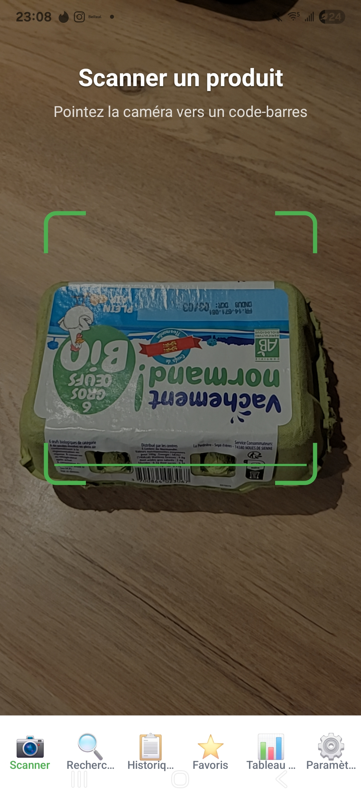
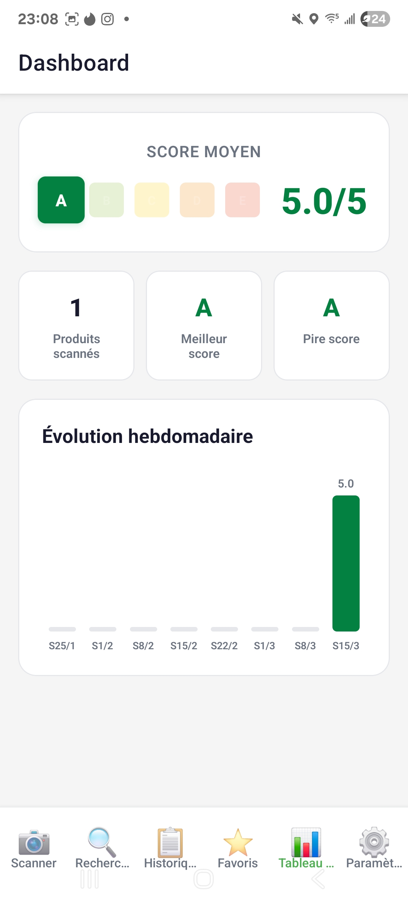
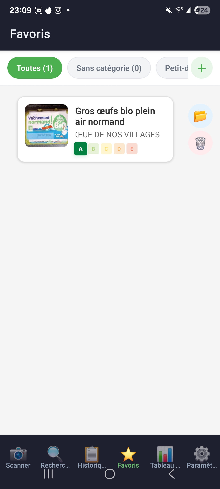
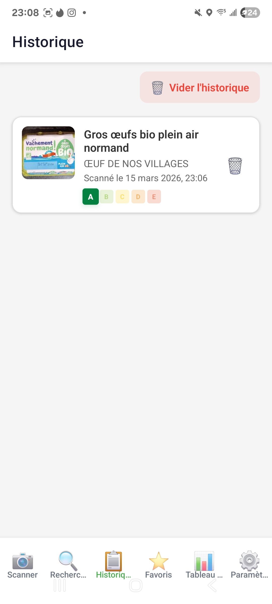
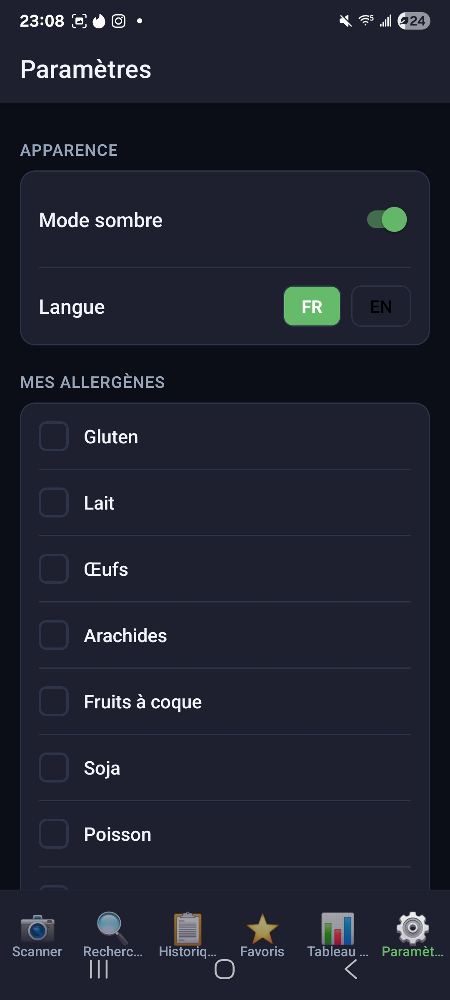

# NutriScan

Application mobile React Native (Expo) de scan et d'analyse de produits alimentaires via Open Food Facts.

NutriScan est une application orientee aide a la decision alimentaire: a partir d'un code-barres ou d'une recherche texte, l'utilisateur accede rapidement aux informations essentielles d'un produit (qualite nutritionnelle, degre de transformation, ingredients, allergenes, valeurs nutritionnelles) pour faire un choix plus eclaire.

Le projet a ete concu pour repondre a un usage quotidien: navigation simple, lecture immediate des resultats, comparaison directe entre deux produits et conservation des produits importants (historique + favoris). L'application propose aussi des reglages personnels (langue, theme, allergenes, regimes) afin d'adapter l'experience a chaque profil utilisateur.

Sur le plan technique, l'objectif etait de livrer une application mobile complete, maintenable et evolutive: architecture TypeScript structuree, separation claire des responsabilites (ecrans, hooks, contextes, utilitaires), et persistance locale des donnees utilisateur.

## Captures d'ecran

Les captures sont referencees depuis le dossier `Image-NutriScan/` a la racine du projet.

### 1) Ecran Scanner


### 2) Ecran Recherche


### 3) Ecran Fiche Produit


### 4) Ecran Favoris


### 5) Ecran Historique


## Installation complete

## 1. Prerequis

- Node.js 18+
- npm 9+
- Expo CLI (via `npx expo`)
- Smartphone Android/iOS avec Expo Go, ou emulateur Android/iOS
- Connexion internet (acces a l'API Open Food Facts)

## 2. Cloner le projet

```bash
git clone <url-du-repo>
cd NutriScan-Supinfo
```

## 3. Installer les dependances

```bash
npm install
```

## 4. Lancer l'application

```bash
npx expo start
```

Puis, dans le terminal Expo:

- Appuyer sur `a` pour lancer sur Android
- Appuyer sur `i` pour lancer sur iOS (macOS requis)
- Appuyer sur `w` pour lancer la version web
- Ou scanner le QR code avec Expo Go

## 5. Scripts disponibles

- `npm run start` : demarre Expo
- `npm run android` : demarre Expo avec cible Android
- `npm run ios` : demarre Expo avec cible iOS
- `npm run web` : demarre Expo en mode web

## Fonctionnalites implementees (liste exhaustive)

## Navigation et architecture

- Navigation par onglets (5 tabs): Scanner, Recherche, Historique, Favoris, Parametres
- Navigation par stacks avec ecrans details et comparateur
- Gestion centralisee de l'etat via Context API (theme, preferences, donnees)

## Scanner

- Lecture de codes-barres avec `expo-camera`
- Gestion des permissions camera
- Detection automatique des codes compatibles (EAN13, EAN8, UPC-A, UPC-E, Code128, Code39)
- Requete API immediate apres scan
- Gestion des erreurs reseau et produit introuvable
- Bouton de rescan rapide

## Recherche

- Recherche textuelle produit (nom/marque)
- Debounce (500 ms) pour limiter les appels API
- Pagination infinie (chargement progressif)
- Affichage du nombre total de resultats
- Etats vides et erreurs geres

## Fiche produit

- Affichage image, nom, marque, quantite
- Affichage Nutri-Score
- Affichage groupe NOVA
- Tableau nutritionnel detaille (pour 100 g)
- Liste d'ingredients
- Liste d'allergenes declares
- Ajout / retrait des favoris depuis la fiche
- Selection de categorie lors de l'ajout en favoris
- Acces au comparateur depuis la fiche

## Comparateur

- Comparaison cote a cote de 2 produits
- Choix du deuxieme produit depuis l'historique
- Comparaison nutritionnelle multi-criteres:
  - calories
  - lipides
  - acides gras satures
  - sucres
  - sel
  - fibres
  - proteines
- Codage couleur par critere (meilleur / moins bon)
- Calcul d'un gagnant global ou egalite

## Historique

- Ajout automatique des produits scannes
- Tri chronologique inverse (plus recent en premier)
- Affichage date/heure du scan
- Suppression d'une entree
- Suppression complete de l'historique avec confirmation

## Favoris et categories

- Ajout/suppression de favoris
- Categories par defaut (Sans categorie, Petit-dejeuner, Snacks sains, A eviter)
- Creation de categories personnalisees
- Suppression de categories non-par-defaut
- Deplacement d'un favori entre categories
- Filtrage des favoris par categorie
- Recherche de categorie dans le modal de deplacement

## Parametres utilisateur

- Theme clair / sombre
- Choix de langue FR / EN
- Gestion des allergenes personnels
- Gestion des preferences alimentaires (vegetarien, vegan, sans gluten, halal, casher)
- Reinitialisation complete des donnees et preferences
- Ecran A propos (version + credits API)

## Persistance locale

- Sauvegarde locale de:
  - historique
  - favoris
  - categories
  - theme
  - preferences utilisateur
- Persistance assuree via AsyncStorage entre les sessions

## Technologies et librairies utilisees

## Stack principale

- React 19
- React Native 0.81
- TypeScript 5
- Expo SDK 54

## Navigation

- `@react-navigation/native`
- `@react-navigation/native-stack`
- `@react-navigation/bottom-tabs`
- `react-native-screens`
- `react-native-safe-area-context`
- `react-native-gesture-handler`

## Fonctionnalites natives et stockage

- `expo-camera` (scan code-barres)
- `@react-native-async-storage/async-storage` (persistance locale)
- `expo-status-bar`

## Source de donnees

- API Open Food Facts
  - endpoint produit par code-barres
  - endpoint recherche paginee

## Repartition du travail (2 membres) - claire et justifiee

La repartition a ete faite par blocs fonctionnels, en suivant les demandes du cahier des charges. Chaque membre prenait en charge un lot principal, puis un point de synchronisation etait fait regulierement pour:

- partager l'avancement
- detecter les blocages
- s'entraider si necessaire
- verifier la coherence globale de l'application

Cette organisation a permis de travailler en parallele, tout en gardant une qualite homogene sur l'ensemble du projet.

Membres du binome:

- Lucas DE BAILLIENCOURT 
- Evan GESRET

### Attribution des lots (d'apres les commits)

| Commit | Lot / fonctionnalite livree | Membre |
|---|---|---|
| `e5a9323` | Initial commit (mise en place du projet) | Lucas DE BAILLIENCOURT |
| `f125dc1` | Creation de l'interface (base UI) | Lucas DE BAILLIENCOURT |
| `d41cc72` | Scanner (camera + lecture code-barres) | Evan GESRET |
| `b674a78` | Page details produit | Evan GESRET |
| `32b20aa` | Recherche de produits | Lucas DE BAILLIENCOURT |
| `33e1abe` | Historique des scans | Lucas DE BAILLIENCOURT |
| `604cb41` | Parametres (langue, allergenes, regimes) | Evan GESRET |
| `af7fd6c` | Comparateur de produits | Evan GESRET |
| `13825ff` | Favoris (gestion et organisation) | Lucas DE BAILLIENCOURT |
| `011e33b` | Dashboard init | Lucas DE BAILLIENCOURT |
| `a727ac2` | Push animations + Navbar fix | Evan GESRET |
| `471f5ad` | Changements finaux app | Evan GESRET |

### Synthese claire de la collaboration

- Lucas DE BAILLIENCOURT: interface initiale, recherche, historique, favoris, initialisation du projet.
- Evan GESRET: scanner, page details, parametres utilisateur, comparateur de produits.

Repartition globale du travail: equilibree, environ 50% / 50%.

## Notes importantes

- L'application depend d'une connexion internet pour interroger Open Food Facts.
- Certaines fiches produits peuvent etre incompletes selon les donnees disponibles dans Open Food Facts.
- L'application est prete pour une demonstration mobile via Expo Go.
